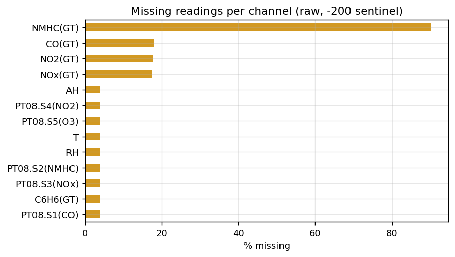
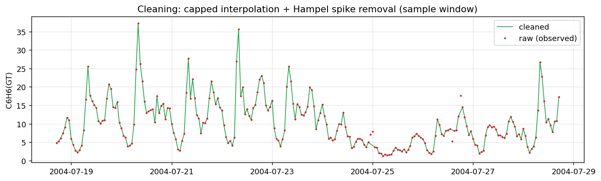
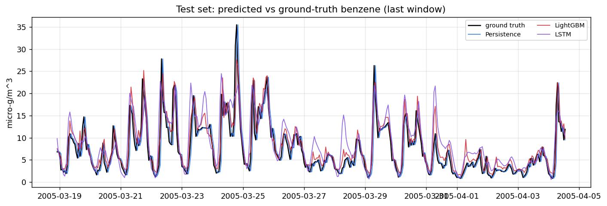
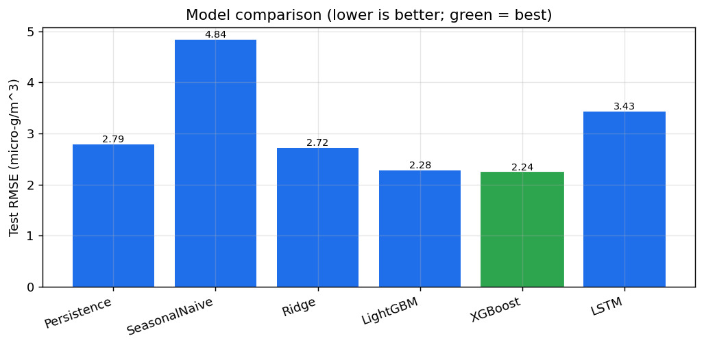
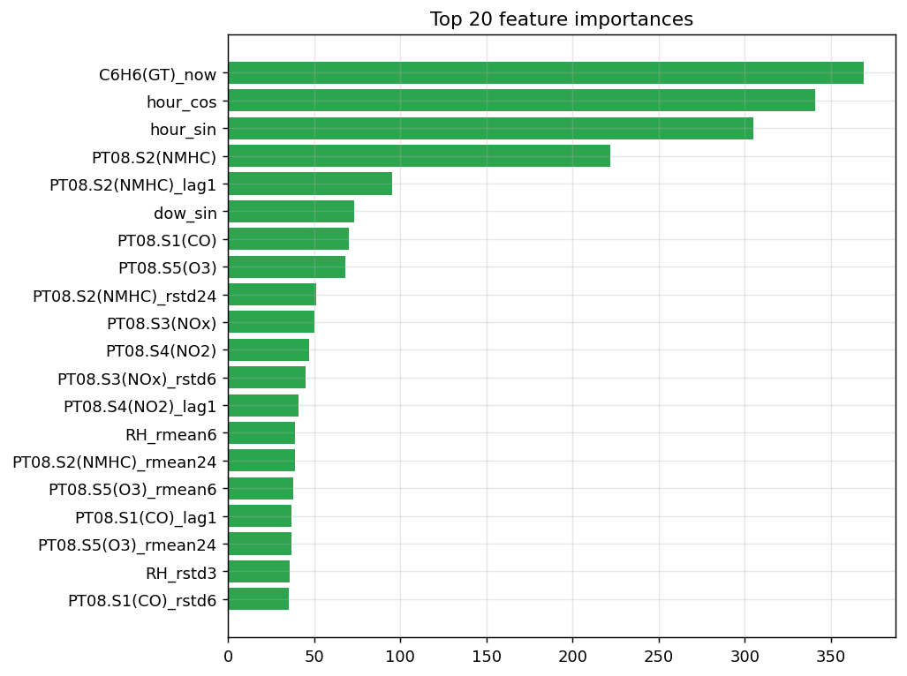

# IoT Sensor Data Trend Prediction

**Assessment 2 — End-to-end ML pipeline on real, noisy field IoT time-series.**

Forecasting the **next-hour benzene concentration** from a field-deployed air-quality
multisensor device, with a full pipeline that cleans real hardware pathologies,
engineers leak-safe temporal features, trains six models against honest baselines,
and evaluates them on a strictly chronological hold-out set.

> **Headline result:** XGBoost predicts next-hour benzene at **RMSE ≈ 2.24 µg/m³,
> R² ≈ 0.81 — about 20% better than a strong persistence baseline.**

---

## 1. Industrial context & target variable *(Must Explain)*

The data is the **UCI Air Quality** dataset: one year (March 2004 – April 2005) of
**hourly** readings from an air-quality **Chemical Multisensor Device** deployed at
road level in a polluted Italian city. The unit carries an array of **five metal-oxide
gas sensors** (`PT08.S1`–`PT08.S5`) plus on-board **temperature, relative-humidity and
absolute-humidity** probes. Co-located reference analyzers provide lab-grade ground
truth for CO, NOₓ, NO₂, NMHC and **benzene (`C6H6(GT)`)**.

This is a textbook industrial IoT monitoring scenario: cheap field sensors that drift,
drop out and pick up noise, deployed to track regulated pollutants.

**Target:** `C6H6(GT)` (benzene, µg/m³) **one hour ahead**. Benzene is chosen because
it is a regulated carcinogen central to urban air-quality monitoring **and** it is the
cleanest reference channel (~3.9% missing vs. ~18% for CO/NOₓ and ~90% for NMHC).
Operationally the task is: *given the device's recent multi-sensor history, predict the
benzene level for the next hour* — useful for early-warning and gap-filling when the
expensive analyzer is offline.

A deliberate realism choice: the model is fed **only the cheap sensors + meteorology**,
never the other lab-analyzer channels, because those lab values would not exist in real
time on a deployed unit.

---

## 2. Repository structure

```
iot-trend-prediction/
├── README.md
├── requirements.txt
├── run_pipeline.py            # one command: raw -> clean -> features -> train -> evaluate
├── build_notebooks.py         # regenerates the executed phase notebooks
├── data/
│   ├── raw/AirQualityUCI.csv  # source data (UCI mirror)
│   └── processed/clean.csv    # generated
├── src/
│   ├── config.py              # all paths + constants in one place
│   ├── data_cleaning.py       # Phase 2
│   ├── features.py            # Phase 3
│   ├── models.py              # Phase 4 (baselines, Ridge, LightGBM, XGBoost, LSTM)
│   ├── evaluate.py            # Phase 5 metrics
│   └── plots.py               # all figures
├── notebooks/                 # executed narrative, one per phase
│   ├── 01_eda.ipynb
│   ├── 02_cleaning.ipynb
│   ├── 03_feature_engineering.ipynb
│   ├── 04_modeling.ipynb
│   └── 05_evaluation.ipynb
├── reports/figures/           # generated PNGs (embedded below)
└── results/metrics.json       # generated metrics
```

The pipeline is split into the **distinct analytical phases** the brief asks for: EDA →
cleaning → feature engineering → modeling → evaluation. Logic lives in `src/`; the
notebooks import it so they stay a clean narrative rather than a wall of code.

---

## 3. Setup & how to run

```bash
python -m venv .venv && source .venv/bin/activate     # optional
pip install -r requirements.txt

# Run the whole thing (prints the results table, writes figures + metrics.json):
python run_pipeline.py

# Regenerate the executed phase notebooks:
python build_notebooks.py
```

Tested on Python 3.12. PyTorch (for the LSTM) is optional — the pipeline degrades
gracefully and still trains the other five models if torch is absent.

---

## 4. Data cleaning *(Must Explain)*

Real field IoT data has four characteristic problems. Each is handled explicitly in
`src/data_cleaning.py`, and each choice is justified by the physics of the signal:

| Pathology | Treatment | Why |
|---|---|---|
| **Missing timestamps** | Reindex onto a gap-free hourly grid | Makes gaps *explicit* `NaN`s instead of silent jumps that would corrupt every lag/rolling feature. |
| **Sensor dropouts** (`-200` sentinel) | `-200 → NaN`, then **time-aware interpolation capped at 6 h** | A pollutant concentration changes continuously, so short gaps interpolate well. Beyond ~6 h the interpolation becomes invented data, so longer outages stay `NaN` and are dropped from the supervised set. |
| **Out-of-bounds spikes** | **Hampel filter** (rolling median + MAD, n=4σ) | MAD is robust to the very outliers being removed; a mean/standard-deviation z-score would be dragged around by the spikes it is supposed to catch. Spikes are blanked and refilled by the same interpolation, so spikes and dropouts share one repair path. |
| **Hardware noise** | Left in the raw signal | Destroying it here loses information; it is instead summarised downstream by rolling-mean/std features. |

`NMHC(GT)` (~90% missing) is dropped entirely — it is unrecoverable and would only inject noise.




*Green = cleaned series, red dots = raw observed values. Short gaps are bridged and
isolated spikes are pulled back to the local level.*

---

## 5. Feature engineering *(Must Explain)*

The supervised frame predicts benzene at **t+1** from information available at **t**.
The guiding rule is **no leakage**: every rolling statistic is computed on a `shift(1)`-ed
series, so a row can never see its own value, and scalers are fit on the training slice only.

- **Lag features** at **1, 2, 3 and 24 h** — short-term momentum plus the strong 24-hour
  daily traffic cycle visible in the EDA.
- **Rolling mean & std** over **3 / 6 / 24 h** — the mean captures the local level/trend;
  the **std captures local volatility**, which is exactly where hardware instability and
  rush-hour swings show up.
- **Cyclical calendar encodings** of hour, day-of-week and month via **sin/cos**, so the
  model learns that hour 23 and hour 0 are neighbours rather than far apart.
- **Current-hour readings**, including the latest benzene value — this is the *same*
  information the persistence baseline uses, so the learned models compete fairly.

This yields **105 features**. Train/val/test = **6,199 / 1,327 / 1,327** rows.

---

## 6. Models & overfitting defence *(Must Explain)*

Six models, chosen so the metrics are interpretable rather than just "a number":

| Model | Role |
|---|---|
| **Persistence** `ŷ(t+1)=y(t)` | The baseline every model must beat. |
| **Seasonal-naive** `ŷ(t+1)=y(t+1−24)` | Tests whether daily seasonality alone is enough. |
| **Ridge** | Transparent linear trend-regression reference. |
| **LightGBM / XGBoost** | Gradient-boosted trees on the engineered features. |
| **LSTM** (PyTorch) | Sequential neural net on raw 24-h windows. |

**How overfitting is guarded against — the part that matters most for time series:**

1. **Chronological split, never shuffled.** Train on the earliest 70%, validate on the
   next 15%, test on the most recent 15%. Random K-fold would leak the future into the past.
2. **Leak-safe features + train-only scaling** (see §5).
3. **Early stopping** for both boosters and the LSTM, monitored on the *time-ordered*
   validation fold — the model stops when it stops improving on genuinely future data.
4. **Regularisation:** capped tree depth (6), `min_child_samples/weight`, subsampling of
   rows and columns, and L1/L2 penalties for the boosters; **dropout (0.2) + weight decay**
   for the LSTM.
5. A `TimeSeriesSplit`-style walk-forward mindset throughout — the held-out test slice is
   strictly later in time than everything the models saw.

---

## 7. Results

Evaluated on the untouched final 15% of the series (most recent ~1,300 hours):

| Model | RMSE ↓ | MAE ↓ | R² ↑ | Skill vs persistence |
|---|---|---|---|---|
| **XGBoost** | **2.24** | **1.58** | **0.81** | **+19.9%** |
| LightGBM | 2.28 | 1.65 | 0.80 | +18.2% |
| Ridge | 2.72 | 2.08 | 0.71 | +2.4% |
| Persistence (baseline) | 2.79 | 1.77 | 0.70 | 0.0% |
| LSTM | 3.43 | 2.38 | 0.55 | −22.8% |
| Seasonal-naive | 4.84 | 3.36 | 0.10 | −73.5% |

*(RMSE/MAE in µg/m³. Exact values in `results/metrics.json`.)*





---

## 8. Key findings

- **XGBoost wins**, beating persistence by ~20% RMSE with R² ≈ 0.81. LightGBM is a
  near-tie. The top features are the **current benzene reading, the `PT08.S2` sensor,
  and short rolling means** — consistent with the sensor array's chemistry.
- **Seasonal-naive is *worse* than persistence.** At a 1-hour horizon the most recent
  reading is far more informative than the same hour yesterday — a useful sanity check
  that the baselines behave as theory predicts.
- **The LSTM learns real structure (R² ≈ 0.55) but does not beat persistence.** This is
  an *expected, honestly-reported* outcome, not a bug: for a strongly autoregressive
  signal with only ~6k training hours, gradient-boosted trees on lag features are a very
  strong, hard-to-beat approach, while an LSTM needs more data or a longer forecast
  horizon to earn its complexity. The point of carrying explicit baselines is to be able
  to say this with evidence.

**Natural next steps:** multi-step (6 h / 24 h) forecasting where the LSTM's sequence
modelling should help more; quantile/interval forecasts for uncertainty; and a small
SHAP analysis of the booster.

---

## 9. Notes for the demo video

Suggested 5–10 min flow: dataset context (§1) → run `python run_pipeline.py` live and
show the console table → walk the cleaning before/after figure → the leak-safe feature
logic → the predictions plot and the model-comparison bar → close on the honest LSTM-vs-
trees finding (§8). The five notebooks mirror this order one phase at a time.
